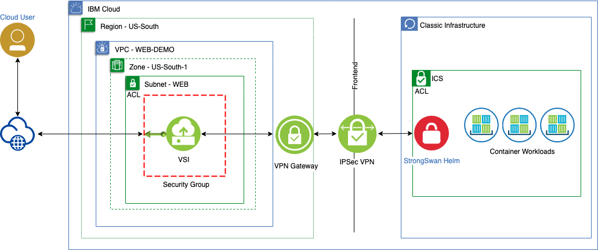

# Use GUI, CLI or API to Connect an App deployed within VPC to an IKS deployment outside VPC
### Purpose

The purpose of this scenario is to connect an App in VPC to an IKS deployemnt
on IBM Public cloud. It demonstrates establishing a VPN connectivity between 
VPC resources and Kubernetes workloads on IKS over a secure vpn tunnel.
It is based on concept of [Setting up VPN connectivity to IKS](https://cloud.ibm.com/docs/containers?topic=containers-vpn)

There are two goals for this scenario:
1. To prove that connectivity can be established between VPC and IKS
2. To build the enablement material to show how to establish the connection between VPC and IKS

### Architecture

## VPC Functional Coverage
| Function | Result | Notes |
| -------- | ------ | ----- |
| VPC | :white_check_mark: | |
| Floating IPv4 | :white_check_mark: | |
| Subnet & BYO Private IP | :white_check_mark: | |
| Instance| :white_check_mark: | |
| IKE policies |  :white_check_mark: ||
| IPsec policies|  :white_check_mark: ||
| VPN Gateway |  :white_check_mark: ||
| VPN Gateway connection|  :white_check_mark: ||

## Prerequisites
The common prerequisite to starting the VPC specific steps is to setup the IKS cluster and deploy helm onto it. Details for both the tasks can be found in 
the following IBM cloud documentations.

* An [IBM Kubernetes Service](https://cloud.ibm.com/docs/containers?topic=containers-getting-started) cluster deployment.
* Helm deployment on IKS: [Setting up Helm in IBM Cloud Kubernetes Service](https://cloud.ibm.com/docs/containers?topic=containers-helm)
 
## Deploying the Scenario
* [Deploy using the CLI](./CLI.md)
* [Deploy using the UI](./UI.md)
* [Deploy using the API](./API.md)